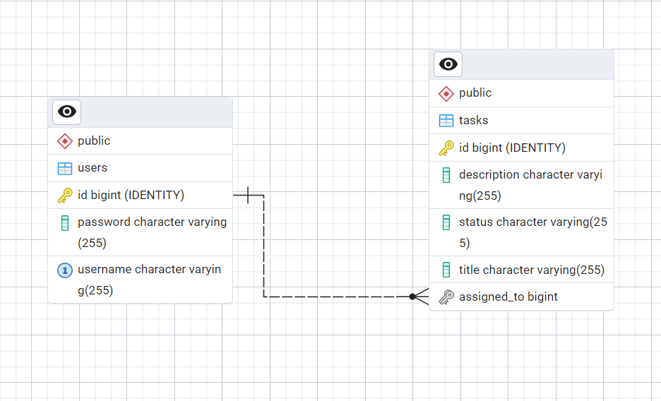
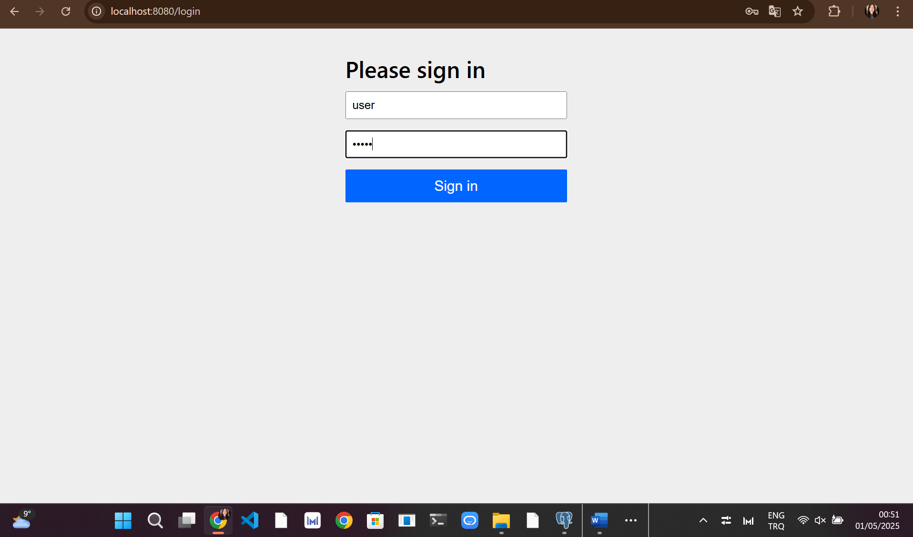
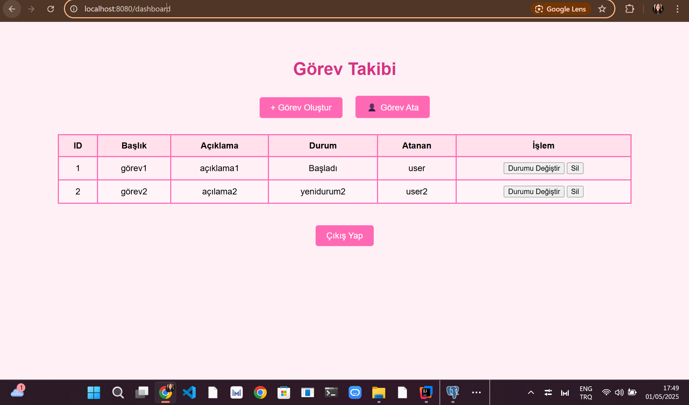
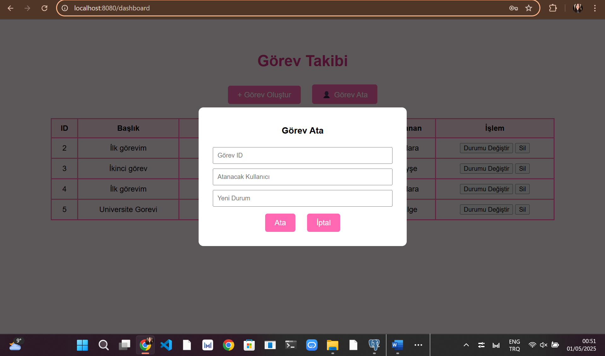
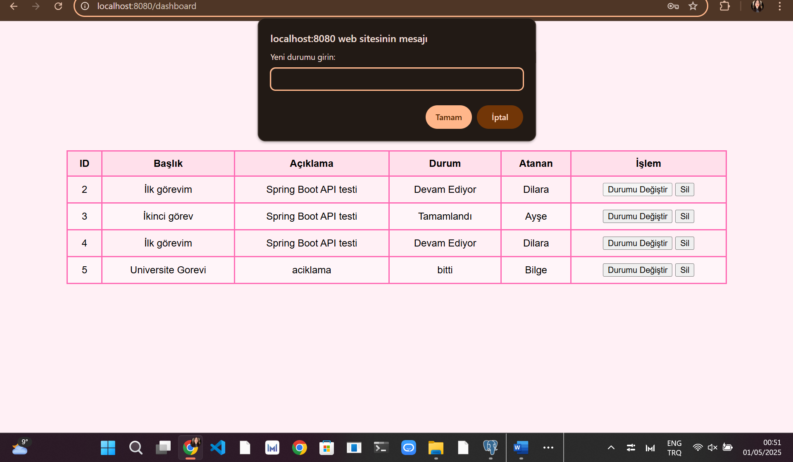
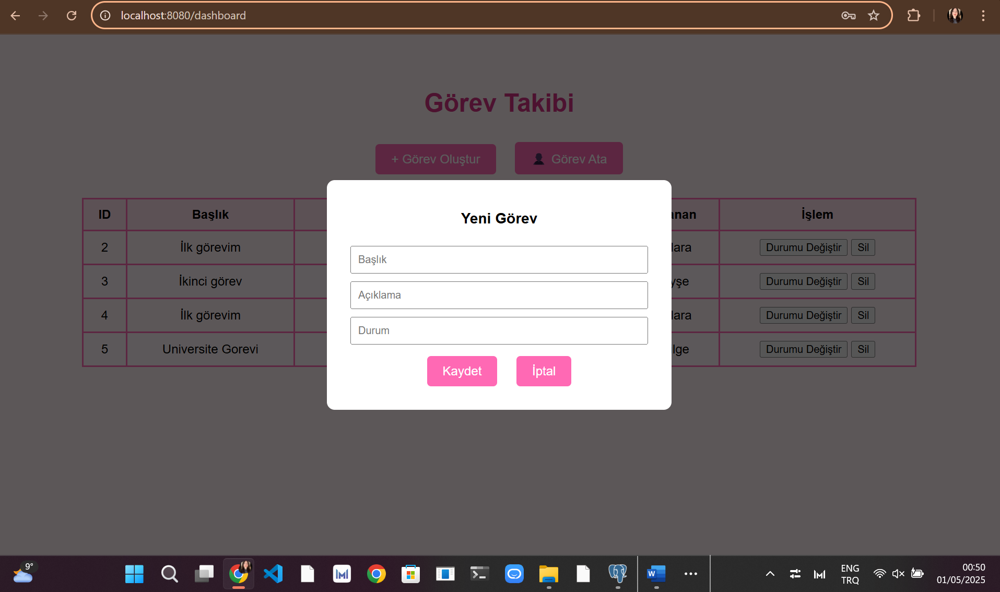

# TaskFlow - Basit Görev Takip Uygulaması

## ✨ Genel Bakış

TaskFlow, kullanıcı girişi sonrası aktif olarak görev oluşturma, atama, durumu güncelleme, silme ve durum takibi işlemlerini destekleyen,
bir Spring Boot tabanlı web uygulamasıdır.

---
## 🛡️ Giriş Bilgisi (Spring Security)

Login ekranından uygulamaya giriş yapmak için Spring Security üzerinden tanımlanmış varsayılan kullanıcı bilgileri:

- **Kullanıcı adı:** `user`,  `user2`,  `user3`,  `user4`
- **Şifre:** `12345`

Bu bilgiler `application.properties` dosyasında aşağıdaki gibi tanımlanmıştır:

```properties
spring.security.user.name=user
spring.security.user.password=12345
```


## 🚀 Çalıştırmak İçin

1. PostgreSQL'de `taskflow_db` adlı DB oluşturun
2. `application.properties` içine veritabanı bilgilerini yazın

```properties
spring.datasource.url=jdbc:postgresql://localhost:5432/taskflow_db
spring.datasource.username=postgres
spring.datasource.password=12345
```

3. Projeyi IntelliJ veya VS Code'da çalıştırın
4. `http://localhost:8080/login` adresinden giriş yapın

---

## 🧪 Testler

```text
TaskServiceImplTest.java
- createTask_shouldReturnSavedTaskDTO
- getAllTasks_shouldReturnTaskDTOList
- createTask_withAssignedTo_shouldSetUser
- updateTask_withAssignedTo_shouldUpdateUser
```

Mock repository ile bağımsız test yapıldı. Gerçek veritabanı etkilenmez.

---


---

## ⚡ Kullanılan Teknolojiler

- **Backend**: Spring Boot, Spring Security, Spring Data JPA
- **Frontend**: HTML, CSS, Vanilla JS (Fetch API)
- **Veritabanı**: PostgreSQL
- **Build Tool**: Maven
- **Test**: JUnit 5, Mockito
- **Docker**: Uygulama PostgreSQL ile birlikte container içinde çalıştırılabilir.

---

## ✅ Proje Özellikleri

- Kullanıcı girişi (hazır login sayfası ile)
- Görev oluşturma (title, description, status)
- Görev atama (ID ile kullanıcı atama + yeni durum)
- Görev durumu manuel olarak değiştirilebilir (prompt ile)
- Görev silme
- Tüm işlemler tek sayfada görsel olarak gerçekleştirilir (dashboard.html)
- Görev–kullanıcı ilişkisi (her görev bir kullanıcıya atanabilir)

---

## 🌐 REST API Uç Noktaları (`TaskController.java` içinde tanımlıdır)

| Yöntem | URL                      | Açıklama                 |
| ------ | ------------------------ | ------------------------ |
| POST   | `/api/tasks/save`        | Yeni görev oluşturur     |
| GET    | `/api/tasks/findAll`     | Tüm görevleri listeler   |
| GET    | `/api/tasks/get/{id}`    | ID'ye göre görev getirir |
| PUT    | `/api/tasks/update/{id}` | Görevi günceller         |
| DELETE | `/api/tasks/delete/{id}` | Görev siler              |

---

### 🔐 Kimlik Doğrulama Uç Noktaları (`AuthController.java` içinde tanımlıdır)

| Yöntem | URL              | Açıklama                      |
|--------|------------------|-------------------------------|
| POST   | `/auth/register` | Yeni kullanıcı kaydı oluşturur |
| POST   | `/auth/login`    | Kullanıcı giriş işlemi yapar   |

---

## ✍‟ Kullanıcı Arayüzü (dashboard.html)

- Bootstrap'siz, temiz ve pembe temalı şık arayüz
- “+ Görev Oluştur” ve “👤 Görev Ata” modalları
- Tablo üzerinden görev durumu değiştirme ve silme

---

## 🧩 Dosya Yapısı

```text
taskflow/
├── src/
│   ├── main/
│   │   ├── java/com/taskflow/
│   │   │   ├── controller/
│   │   │   ├── service/
│   │   │   ├── entity/
│   │   │   └── repository/
│   │   └── resources/
│   │       ├── application.properties
│   │       └── templates/dashboard.html
│   └── test/java/com/taskflow/service/TaskServiceImplTest.java
├── Dockerfile
├── pom.xml
└── README.md
```
## 🗃️ Veritabanı Yapısı (ERD)

Görevler (`tasks`) tablosu, kullanıcılar (`users`) tablosuyla bire çok (many-to-one) ilişkilidir.  
Her görev sadece bir kullanıcıya atanabilir (`assigned_to`), ancak bir kullanıcı birden fazla göreve atanabilir.



## 🖼️ Uygulama Görünümü








## 👤 Örnek Kullanım Senaryosu

1. **Kullanıcı Ali**, sisteme giriş yapar.
2. Yeni bir görev oluşturur: "Rapor hazırla"
3. Bu görevi "Ayşe" isimli kullanıcıya atar.
4. Ayşe giriş yapar, görevi "Devam Ediyor" durumuna çeker.
5. Görevi tamamladıktan sonra durumunu "Tamamlandı" olarak günceller.
6. Ali görevin tamamlandığını görür ve görev listesinden siler.

---

♡ [Dilara Aydoğmuş] (https://github.com/Dilara-Aydogmus/taskflow)

